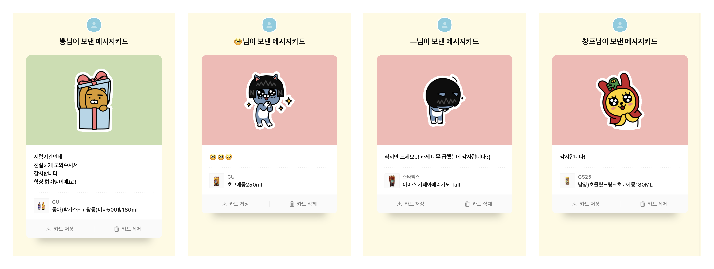

## 과제도와주기 프로젝트

일시: 2021-03-29 ~ 2021-05-29 (2개월) + 진행중

대상: 코딩 과제에 쩔쩔매는 비전공자 대학생

동기: 내가 가장 바쁜 시기임에도, 나와 관련 없는 사람들에게 도움을 주는 일을 해보고 싶었다.

## 프로젝트 후기

생각보다 도움을 절실히 필요로 하는 학생이 많다는 사실을 알게 되었다. 단순히 과제를 해결해주는 것이 아닌, 함께 공부해나가는 방식으로 프로젝트를 진행하였다. 14번의 프로젝트를 업로드하였지만 2개월간 총 30번 내외의 사람을 도와주었다. 그 중 절반 이상은 소소한 선물을 받았다. 보상을 바라서 진행했던 프로젝트는 아니었지만, 가끔 받는 기프티콘은 적잖은 힘이 되었다.

